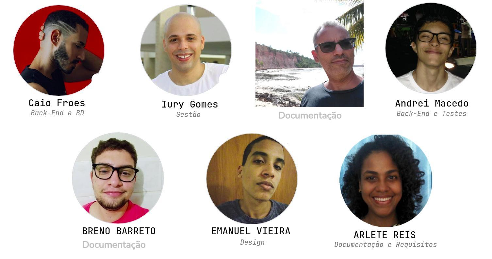

# Sistema de Progressões Acadêmicas da UFBA
Repositório contendo o projeto desenvolvido para a disciplina de TÓPICOS EM SISTEMAS DE INFORMAÇÃO E WEB I, do PGCOMP (Programa de Mestrado em Ciência da Computação da UFBA) sob orientação do Prof. Dr. Fred Durão, no ano de 2021

# Quem somos nós

  

- [Iury Gomes de Oliveira](https://github.com/iurygdeoliveira) (Gestão)
- [Lucas Ferreira](https://github.com/KasFerreira) (Implantação)
- [Andrei Macedo](https://github.com/asmcdo) (Back-End e Testes)
- [Breno Barreto de Souza Santos](https://github.com/brenobss) (Front-End)
- [Emanuel Vieira](https://github.com/emanuelvs) (Design)
- [Cayo Froes](https://github.com/froescayo) (Back-End e BD)
- [Arlete Reis](https://github.com/arllette) (Requisitos e Documentação)

# Objetivo

# Proposta de Solução 

# Tecnologias Utilizadas
## [Diagramas UML]()
- Caso de Uso
- Atividade
- Sequencia
## [Front-End](https://github.com/froescayo/prog-acad-web)
- HTML5
- CSS3
- JS
- ReactJS
## [Back-End](https://github.com/froescayo/prog-acad-api)
- Docker
- TypeScript
## Deploy
- Em análise
## Cenários de Teste
- Em análise
